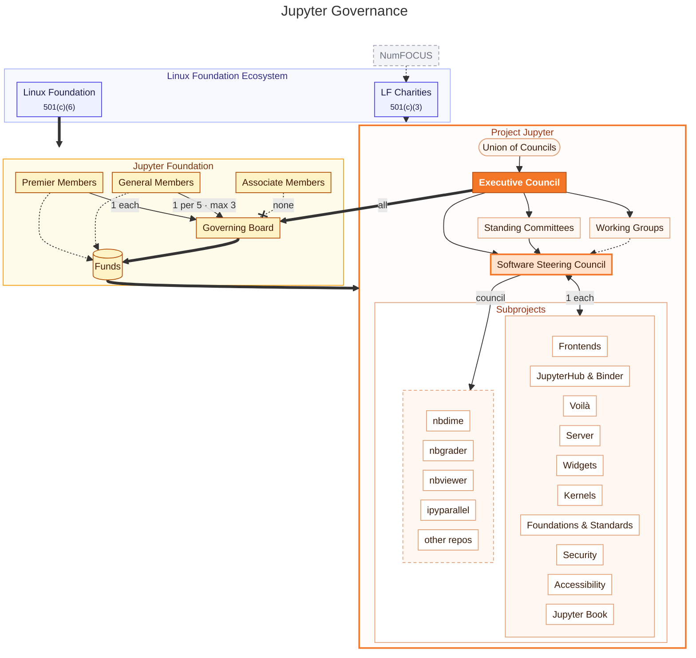

# Jupyter Governance Overview

:::{note}
Jupyter transitioned from a [Benevolent Dictator For Life (BDFL) + Steering Council](archive/governance.md) governance model to this current governance model in December 2022.

This document provides a brief informational summary of the Project Jupyter governance model. In case of any substantive discrepancy with the official descriptions of each body, the underlying governance documents should be considered as the source of truth, and we will update this overview as needed.
:::





Jupyter’s governance model is anchored on three bodies that complement each other:

1. The [**Executive Council (EC)**](executive_council.md) is ultimately responsible for all dimensions of the Project (including, but not limited to, software, legal, financial, community, operations, inclusion and diversity, etc.). The members of the EC actively work to carry out the Project's mission in accordance with its values and to support operations through delegation to the Software Steering Council (SSC), Software Subprojects, Standing Committees, and Working Groups. These other bodies will report to the EC, and the EC is expected to support, oversee, manage, and ensure the success of operations across Jupyter. For more detail, see the [Executive Council document](executive_council.md).

   **Current Members:**

   ```{team-members} executive_council
   ```

2. The [**Software Steering Council (SSC)**](software_steering_council.md) has jurisdiction over software-related decisions across Project Jupyter, with a primary focus on coordination across projects and decisions that have impact across many Jupyter Subprojects. It is also a mechanism for representatives of each project to share information and expertise. Technical decisions and processes where the SSC isn't explicitly involved are automatically delegated to the individual projects to manage their day-to-day activities, create new repositories in their orgs, etc., with independence and autonomy. For more details, see the [Software Steering Council document](software_steering_council.md).

   **Current Members:**

   ```{team-members} software_steering_council
   ```

3. The [**Jupyter Foundation**](./jupyter_foundation.md) is a directed fund of the Linux Foundation 501(c)(6) that exists to provide resources and strategic counsel to Project Jupyter. The Executive Council serves on the Jupyter Foundation Governing Board. For more details, see the [Jupyter Foundation document](./jupyter_foundation.md).

   **Current Governing Board Members:**

   ```{team-members} jupyter_foundation
   ```

Additionally, the Executive Council (EC) receives input from a Community Advisory Panel. This panel advises the EC with perspectives and connections that may reach beyond the active Jupyter community.

## Other major components of the organization

In addition to these three bodies, the following are other major parts of the Project related to governance.

### Software Subprojects

[Software Subprojects](software_subprojects.md) in the Jupyter community are official areas of focus and effort within the Jupyter ecosystem. They often map to a single GitHub organization. Subprojects must abide by the [Jupyter Code of Conduct](conduct/code_of_conduct.md), Jupyter decision-making and governance processes (e.g. respecting the project's trademark policies), as well as commit to certain technical limitations and scope. Each Subproject maintains a Subproject Council and elects one person from the Subproject Council to serve on the Software Steering Council. For more details, see the [Software Subprojects document](software_subprojects.md).

### Standing Committees and Working Groups

In addition to the software work on Jupyter that is coordinated through the Software Steering Council (SSC), much of the project’s work expands beyond software. Examples include code of conduct incident response, diversity and inclusion, operations, legal, fundraising, events, community, and marketing. [Standing Committees and Working Groups](standing_committees_and_working_groups.md) carry out this non-software related work of the project by delegation from the Executive Council (EC).

The primary difference between Standing Committees and Working Groups is that Standing Committees are intended to be permanent; they are only created and dissolved by a joint vote of the EC and SSC. In contrast, Working Groups can be created and dissolved by the EC acting alone.

For more details, see the [Standing Committees and Working Groups document](standing_committees_and_working_groups.md).

### Union of Councils

The Union of Councils represents the combination of councils, sub-councils, and working groups in Jupyter.
See [the Union of Councils section](#union-of-councils) for more information.


### Distinguished Contributors

The [Distinguished Contributors](distinguished_contributors.md) are a group of Jupyter community members that have gone above-and-beyond in their support of the project over the years, making substantial and sustained contributions in any area of activity (software development, governance, community engagement, events, etc.). The Jupyter community confers membership in this group as a way of recognizing their effort and saying “thank you.” For more details, see the [Distinguished Contributors document](distinguished_contributors.md).

## Decision-making and voting procedures

The EC, SSC, Standing Committees and Working Groups all use uniform voting procedures outlined in the [Decision-Making Guide](decision_making.md).

