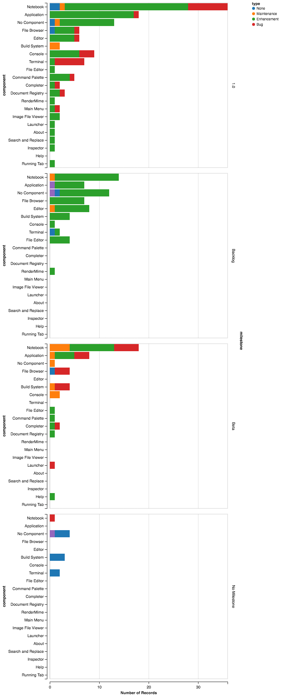

# GitHub Milestone and Issue Workflow

This purpose of this document is to describe our development workflow on
GitHub; in particular, how we use milestones and issues. We recognize that our
many subprojects may use variations of these ideas. This particular workflow is
based on the practices from the JupyterLab repo
(https://github.com/jupyterlab/jupyterlab) and are optional for Jupyter
subprojects to follow.

## Milestones

We use Github milestones to track issues and pull requests related to particular
releases of a subproject (https://github.com/jupyterlab/jupyterlab/milestones).

* These milestones should be labeled with the version numbers of the releases
  (`4.3`, `5.0`, etc.).
* Subprojects should only have a few numbered milestones. Beyond one or two
  future releases, we have found that detailed milestones become meaningless.
* Subprojects should also have a `Backlog` milestone for issues and pull
  requests that have not been assigned to a particular release milestone. This
  also includes new feature requests ("wishlist") issues that we haven't
  committed to implementing. Essentially, `Backlog` means "at some point in the
  future, maybe."
* Subprojects should have a `No Action` milestone to indicate issues or pull
  requests that were closed with no action or work being performed. In general
  we try to close issues/PRs with this milestone.
* The only time an issue should have no milestone is early on in the triage
  process when it still has the `status:Needs Info` label.

## Labels

We use GitHub labels to organize issues and pull requests
(https://github.com/jupyterlab/jupyterlab/labels). The Github issues namespace
is completely unstructured; each label is simply a name with an associated
color. This unstructured nature, makes it difficult to organize work
effectively. To address, this challenge, we are started to use a more formal
label schema/taxonomy.

### Internal-facing Labels

Typically, every label should have one of four prefixes:

[1. `type:`](`type:`)
[2. `component:`](`component:`)
[3. `cat:`](`cat:`)
[4. `status:`](`status:`)

All issues of a given prefix should have the same color to make visual
identification easy.

#### `type:`

The `type:` prefix indicates the type of issue or pull request. There are four
types:

* `type:bug`
* `type:enhancement`
* `type:maintenance`
* `type:question`

Guidelines:

* Each issue or pull request should have only one `type:` prefixed label.
* Limiting ourselves to these four types allows us to query our issues in a 
  structural and relational manner.

#### `component:`

The `component:` prefix indicates the component or part of the software the
issue is related to. Thus, on the JupyterLab repository, we have labels such as:

* `component:About`
* `component:Application`
* `component:Build System`
* `component:Command Palette`
* `component:Completer`
* `component:Console`
* `component:Notebook`
* `component:Terminal`
* `component:File Browser`
* `component:File Editor`
* ...

Guidelines:

* A single issue or pull request can have multiple `component:` labels, but
  usually it will be a small number.
* Each subproject will have its own unique set of `component:` labels.

#### `cat:`

The `cat:` prefix indicates the "category" of the issue. The category is sort of
mixin to the `component:` label to indicate cross-cutting categories such as:

* `cat:Accesibility`
* `cat:Design and UX`
* `cat:Documentation`
* `cat:Examples`
* `cat:Settings`

Guidelines:

* A single issue or pull request can have multiple `cat:` labels.
* Each subproject will have its own unique set of `cat:` labels, but effort
  should be taken to use common names.

#### `status:`

The `status:` prefix indicates the status of the issue or pull request, such as:

* `status:Blocked`
* `status:Duplicate`
* `status:Inactive`
* `status:Needs Discussion`
* `status:Needs Info`
* `status:Needs Review`
* `status:Needs User Testing`
* `status:Wont Fix`
* `status:Work in Progress`

Guidelines:

* A single issue or pull request can have multiple `status:` labels.
* Subprojects should use ths standard set of `status:` labels, but are free to
  add additional ones.

### External-facing Labels

For outside open source initiatives from [GitHub](https://help.github.com/articles/finding-open-source-projects-on-github/) and events such as [Hacktoberfest](https://hacktoberfest.digitalocean.com/) or [Write/Speak/Code](http://www.writespeakcode.com/), organizations often request a specific name for contributor-friendly issues.

Across [GitHub](https://help.github.com/articles/about-labels/), `good first issue` is the common label for beginner-friendly issues.  `help wanted` indicates interest in external help from the community on an issue.

Additional labels such as `hacktoberfest` are based on open source initiatives for which we'd like additional help.

## Structured queries 

This taxonomy has been designed to allow structured queries to be performed on
the issues of one or more repositories. An example of this type of query is
provided below for the JuptyerLab repository. This visualization shows the
number of issues grouped by type (color), component (x) and milestone (row):

## Checklist

Here is a brief checklist developers can use to help them follow this workflow:

* Each issue/PR has one milestone or the `status:Needs Info` label.
* Each issue/PR has exactly one `type:` label.
* Each issue/PR has a few `component:` labels.
* Issues/PRs that are closed with no action are assigned the `No Action`
  milestone.
* All issues/PRs of a given prefix have the same color.
* The text after the label prefix (`type:`, `component:`) are written with
  heading case: `Work in Progress` to make structured queries nice to read.
* The standard set of `type:` and `status:` labels listed above are used
  whenever possible.

